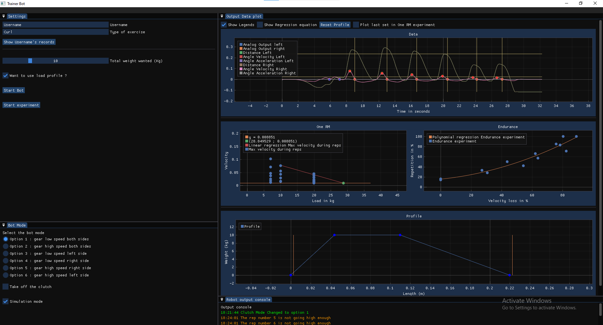

# Coach Bot

CoachBot is a C++ application that controls and gets data from fitness robots. 
The robots use motors to apply a specific torque to the fitness bar so the user can lift it like a regular bar with plate weights. 

<table>
  <tr>
    <td></td>
    <td></td>
  </tr>
</table>

The project aims to estimate the athlete's One-Repetition maximum (OneRM). The OneRM is the maximum load that someone can lift in only one repetition. Trying to know one's OneRM requires lifting a really heavy load. It can be dangerous for muscles and joints, especially for injured people. This is why we need to estimate it. 
The software helps people to use a machine that can help them estimate their One RM. 

The second goal is to estimate the athlete's Endurance. This is the maximum number of repetitions an athlete can do at a specific load. This is  
It is separated into five main C++ classes. Trainer, TrainerApp, TrainerBotManager, TrainerDataManager and TrainerPredictor.

## Screenshot of the application's home page

## Class Diagram

## Project Report

## Authors

- [@Clem-Pat](https://www.github.com/Clem-Pat)

